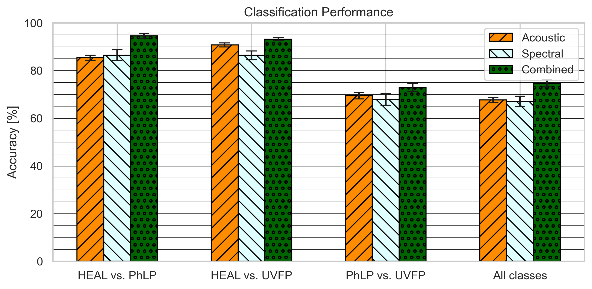

# Pathological Voice Classification using Spectral and Acoustic Features


This repository contains the code and data associated with the paper:

> **"Discriminating Voice Pathologies Through a Combination of Spectral and Acoustic Features"**  
> B. Rodrigues, H. Cordeiro, G. Marques  
> CENTERIS – International Conference on ENTERprise Information Systems / ProjMAN / HCist 2024  
> *Procedia Computer Science*, Volume 256, Pages 835–842, 2025  
> DOI: [10.1016/j.procs.2025.02.185](https://doi.org/10.1016/j.procs.2025.02.185)

The work investigates whether combining spectral (MFBM) and acoustic (jitter, shimmer and HNR) parameters improves the discrimination of healthy and pathological voices, using sustained vowel /a/ recordings and a Support Vector Machine (SVM) classifier.

### Methodological Note
All results shown below were obtained using the current implementation in this repository.
<b>Minor differences from the original publication may occur </b>due to refactoring and random seed handling.<br>
Values are reported as <b>mean ± standard deviation</b> across cross‑validation folds, rather than mean ± 95% confidence interval as presented in the article.

---

## Overview

This work addresses the following question: <br>
> Does combining spectral and acoustic parameters improve the discrimination of healthy speakers (HE), speakers with physiological laryngeal pathologies (PhLP), and speakers with unilateral vocal fold paralysis (UvfP)?

Four classification tasks are addressed: three One vs. One binary and one 3-class, each performed with acoustic features only, spectral features only, and their combination.

### 1. Binary and 3-class classification accuracies (in %)

| Method     | HE vs PhLP       | HE vs UVFP       | PhLP vs UVFP     | 3-Class          |
|------------|------------------|------------------|------------------|------------------|
| Acoustic   | 85.35 ± 1.03     | 90.71 ± 0.85     | 69.43 ± 1.30     | 67.63 ± 1.12     |
| Spectral   | 86.46 ± 2.28     | 86.41 ± 1.84     | 67.85 ± 2.42     | 67.01 ± 2.20     |
| Combined   | 94.48 ± 1.06     | 93.17 ± 0.57     | 72.83 ± 1.70     | 74.67 ± 1.50     |

The figure below shows a bar plot summarizing the accuracies of all 12 experimental conditions (four tasks × three feature sets).



### 2. One-vs-All classification results (derived from 3-class model) (in %)

These results are derived directly from the 3‑class confusion matrices, enabling fair comparison with previous studies that report One‑vs‑All performance on the same corpus subset.

| Method     | HE vs All        | PhLP vs All      | UVFP vs All      |
|------------|------------------|------------------|------------------|
| Acoustic   | 88.36 ± 0.64     | 70.32 ± 1.13     | 76.59 ± 0.94     |
| Spectral   | 88.02 ± 1.09     | 72.81 ± 2.11     | 73.20 ± 2.04     |
| Combined   | 92.91 ± 0.67     | 77.56 ± 1.58     | 78.86 ± 1.36     |

### 3. Binary and 3-class classification AUC (area Under the Curve)

AUC scores provide a threshold-independent measure of  of discriminative performance

| Method     | HE vs PhLP | HE vs UVFP | PhLP vs UVFP |
|------------|------------|------------|--------------|
| Acoustic   | 0.9048     | 0.9613     | 0.7541       |
| Spectral   | 0.9290     | 0.9331     | 0.7104       |
| Combined   | 0.9644     | 0.9792     | 0.7685       |

Across all tasks, <b>combining acoustic and spectral parameters consistently yields the highest performance</b>.

---

## Original Paper

This repository re-implements the methodology and experimental results presented in:

- Rodrigues et al., *HCist 2024*: [Full paper (PDF)](paper/Rodrigues_et_al_HCist2024.pdf)

---

## Repository Structure

```
├── data/
│   ├── mysMEEI
│   │   └── mysMEEI.csv                	# Audio corpus metadata (filename, age, gender, group)
│   └── processed/
│       └── mysMEEI.parquet             # Pre-extracted features (no audio signals)
│
├── paper/
│   └── Rodrigues_et_al_HCist2024.pdf   # Original article re-implemented by this repository
│
├── notebooks/
│   ├── 01_feature_extraction.ipynb     # Spectral and acoustic feature extraction
│   └── 02_classification.ipynb         # Classification, cross-validation, results
│
├── results/
│   ├── figures/                        # Plots and visualisations
│   └── metrics/                        # Accuracy tables, confusion matrices and per-class metrics
│
├── src/
│   ├── data_loader.py                      # Load audio files and metadata
│   ├── mel_filterbank.py                   # Define Mel filterbank (custom bands)
│   ├── get_MFBM.py                         # Extract Mel Frequency Band Magnitudes (MFBM)
│   ├── extract_voice_features.py           # Compute acoustic features (Jitter, Shimmer, HNR)
│   ├── build_X.py                          # Assemble feature matrices for classification
│   ├── run_cv_experiment.py                # Cross-validation pipeline (SVM, metrics)
│   ├── export_dataframe.py                 # Save extracted features to disk
│   ├── import_dataframe.py                 # Load precomputed feature data
│   ├── plot_meldefined_magnitudes_per_class.py  # Visualise spectral features per class
│   └── plot_acoustic_features.py           # Visualise acoustic feature distributions
│
├── .gitignore
├── LICENSE
├── README.md
└── requirements.txt
```

---

## Data

### Audio Corpus (MEEI)

The audio signals used in this work are a subset of the **Massachusetts Eye and Ear Infirmary (MEEI)** Voice Disorders Database, commercialised by Kay Elemetrics Corp. The subset is identical to the one used in [1][2], and some results are compared in the article.

| Class | Description | N |
|-------|-------------|---|
| HE | Healthy speakers | 36 |
| PhLP | Physiological laryngeal pathologies (vocal nodules, edema) | 56 |
| UvfP | Unilateral vocal fold paralysis | 59 |
| **Total** | | **151** |

Signals contain the sustained vowel /a/, sampled at 25 kHz, 16-bit PCM encoding. One signal per speaker was used, with no separation by age or gender.

The audio files are **not included** in this repository as the MEEI database is a commercial product.

### Known Limitations of the MEEI Database

The MEEI database is widely used in the literature, but presents known methodological limitations that should be considered when interpreting results. These limitations are documented in the literature (Saenz-Lechon et al., 2006) and are acknowledged here as a limitation of the present work.

---

## Method

### 1. Pre-processing
- Amplitude normalisation (absolute maximum set to 1)
- Silence removal at signal boundaries using an energy threshold method based on [3]]

### 2. Spectral Feature Extraction
- Framing: 30 ms windows, 10 ms step; first and last 3 frames discarded
- FFT: 4096-point, per frame
- Mel filterbank: 20 triangular filters, unit area, uniformly spaced on the Mel scale, covering 0–4 kHz
- Per-band mean and standard deviation computed across frames → two 20-dimensional vectors
- Last 8 dimensions discarded (high-frequency bands, not discriminative)
- Remaining 12 dimensions split into lower (bands 1–6) and intermediate (bands 7–12) frequency groups
- PCA: trained on training set; applied to both sets; lower bands reduced to 2 PCs, intermediate to 1 PC
- Final spectral representation: 6 dimensions (four arrays: 2+2+1+1)

### 3. Acoustic Feature Extraction
- Extracted via Parselmouth (Python interface to Praat) [4]
- Features: Jitter (%), Shimmer (%), Harmonic-to-Noise Ratio (HNR)
- Final acoustic representation: 3 dimensions

### 4. Feature Combination
- Spectral (6D) and acoustic (3D) features concatenated → 9-dimensional feature vector

### 5. Classification
- Classifier: SVM with RBF kernel (Scikit-learn defaults)
- Scaling: StandardScaler fitted on training data, applied separately to train and test
- Validation: Stratified 5-fold cross-validation, 1000 iterations with unique random states
- Metric: Accuracy reported as mean ± standard deviation across iterations

### Note on Terminology
The spectral features extracted are **filterbank magnitudes**, not energies, despite the terminology used in the published article. This reflects an evolution of the codebase during the research; the results were obtained using magnitudes, as implemented here.

---

## Key Findings

The experimental results highlight several consistent patterns across all classification tasks:

- **Feature combination is consistently beneficial**: Combining acoustic and spectral features yields the highest performance across all classification tasks, outperforming either feature set used in isolation.
- **Feature relevance is class-dependent**: Spectral features show greater discriminative power for PhLP, while acoustic features are more effective for identifying UvfP, suggesting that different pathologies manifest more strongly in distinct feature domains.
- **Complementarity between feature types**: The observed performance gains indicate that acoustic and spectral features capture complementary information, reinforcing the advantage of integrating both representations.

These findings suggest potential benefits in adopting ensemble or hierarchical classification strategies, where acoustic and spectral features are processed separately and combined at a later stage, leveraging their complementary discriminative contributions.

---

## Usage

### Requirements

See requirements.txt for dependencies.

### Option A — Starting from pre-extracted features

Open and run `notebooks/02_analysis.ipynb` directly. No audio files required.

### Option B — Starting from audio files

Place the audio files in the expected directory structure:

```
data/
└── mysMEEI/
    ├── mysMEEI.csv
    ├── control/
    │   └── *.wav
    ├── edema/
    │   └── *.wav
    ├── nodulo/
    │   └── *.wav
    └── UVFP/
        └── *.wav
```

Then run `notebooks/01_feature_extraction.ipynb` followed by `notebooks/02_analysis.ipynb`.

---

## Citation

If you use this code in your research, please cite:

```bibtex
@article{rodrigues2025,
  author    = {Rodrigues, Bruno and Cordeiro, Hugo and Marques, Gonçalo},
  title     = {Discriminating Voice Pathologies Through a Combination of Spectral and Acoustic Features},
  journal   = {Procedia Computer Science},
  volume    = {256},
  pages     = {835--842},
  year      = {2025},
  issn      = {1877-0509},
  doi       = {10.1016/j.procs.2025.02.185},
  url       = {https://www.sciencedirect.com/science/article/pii/S1877050925005460}
}
```

---

## References

[1] H. Cordeiro, J. Fonseca, I. Guimarães, C. Meneses, "Hierarchical Classification and System Combination for Automatically Identifying Physiological and Neuromuscular Laryngeal Pathologies," Journal of Voice, 2017.

[2] H. Cordeiro, J. Fonseca, I. Guimarães, C. Meneses, "Voice Pathologies Identification: Speech Signals, Features and Classifiers Evaluation," SPA, 2015.

[3] L. Lamel, L. Rabiner, A. Rosenberg, J. Wilpon, "An Improved Endpoint Detector for Isolated Word Recognition," IEEE Transactions on Acoustics, Speech and Signal Processing, 1981.

[4] Y. Jadoul, B. Thompson, B. de Boer, "Introducing Parselmouth: A Python Interface to Praat," Journal of Phonetics, 2018.

---

## License

This project is licensed under the MIT License — see the [LICENSE](LICENSE) file for details.
